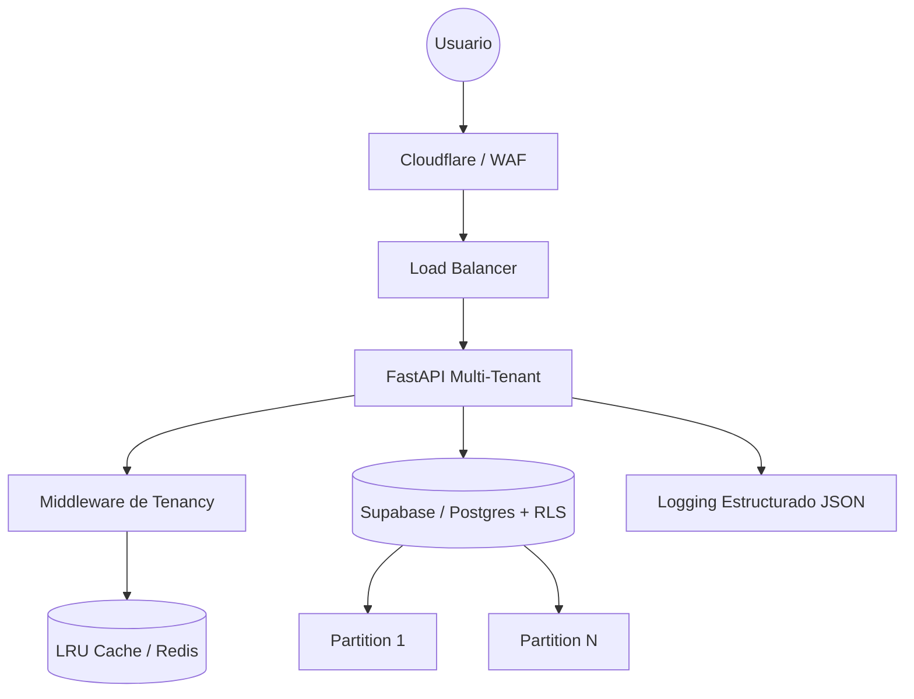

# Sistema Corporativo Enterprise - Multi-Tenant

Arquitectura de alta disponibilidad y aislamiento estricto diseñada para soportar 4,000+ organizaciones concurrentes utilizando PostgreSQL Row Level Security (RLS) y FastAPI.

## Arquitectura



## Características Enterprise

- **Aislamiento RLS**: Cada query a la base de datos se filtra automáticamente por `tenant_id` a nivel de motor SQL.
- **Observabilidad 360**: Logs JSON que incluyen `tenant_id`, `user_id`, `trace_id` y `duration_ms`.
- **Pool Elástico**: Gestión de conexiones asíncronas con limpieza de sesión (`RESET LOCAL`).
- **Health Checks**: Endpoints de preparación y liveness para orquestación Zero-Downtime.

## Deployment Rápido

### Requisitos

- Python 3.9+
- PostgreSQL con extensión RLS activa (Supabase recomendado)
- Redis (para Rate Limiting avanzado)

### Variables de Entorno

```bash
POSTGRES_HOST=your_host
POSTGRES_PORT=5432
POSTGRES_USER=postgres
POSTGRES_PASSWORD=your_password
POSTGRES_DB=postgres
JWT_SECRET=your_ultra_secure_secret
```

### Ejecución

```bash
cd sistema-corporativo/backend
pip install -r requirements.txt
uvicorn main:app --host 0.0.0.0 --port 8000
```

---

© 2026 Sistema Corporativo Enterprise.
